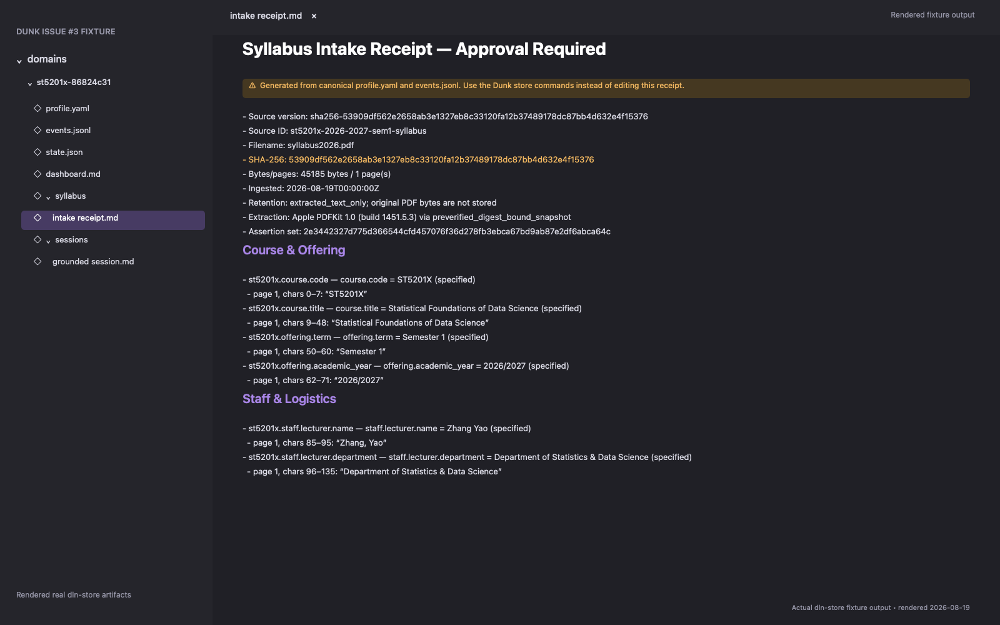
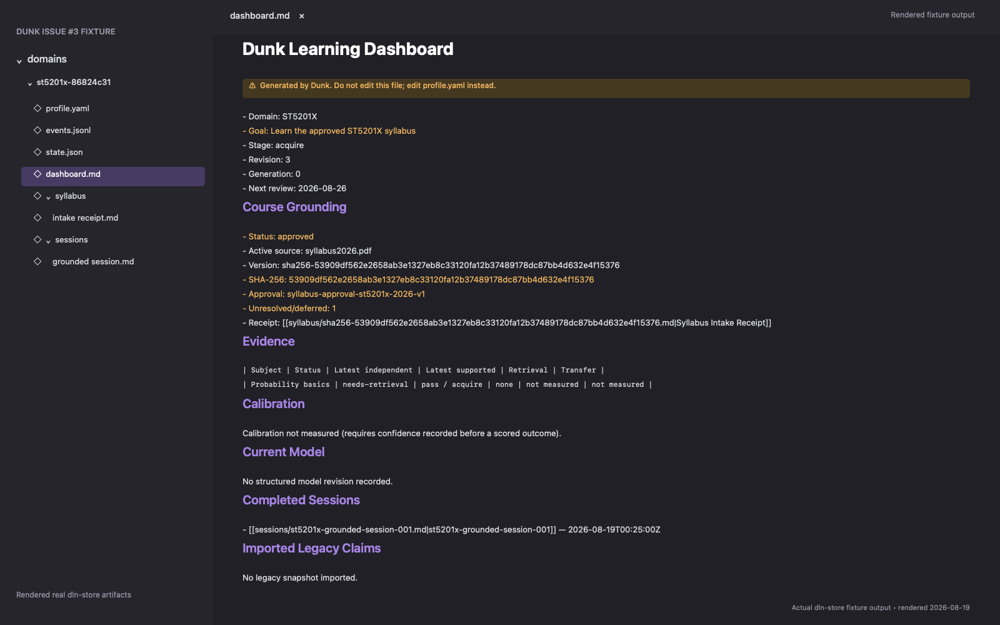
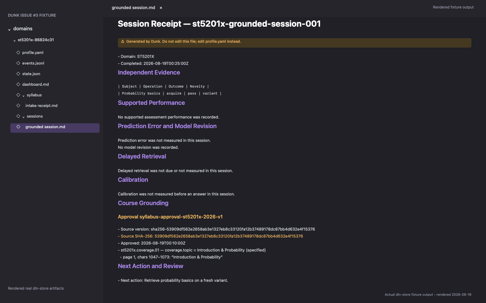

# Issue #3 — Authoritative ST5201X Syllabus Evidence

This package reproduces the acceptance evidence for Dunk 2.1.0's exact digest-bound `st5201x-2026-v1` adapter. It uses the tracked 45,185-byte fixture with SHA-256 `53909df562e2658ab3e1327eb8c33120fa12b37489178dc87bb4d632e4f15376`, a disposable vault, real `dln-store` commands, the complete Dunk test suite, and strict plugin validation.

The adapter is deliberately fixture-specific. Raw PDF bytes are not copied into the learner store, generic PDF/OCR support is not claimed, and the Week 7–13 row alignment remains explicitly unresolved.

## Screenshots

### Pre-approval Syllabus Intake Receipt



Rendered from the generated pending `syllabus/sha256-53909df562e2658ab3e1327eb8c33120fa12b37489178dc87bb4d632e4f15376.md` before approval.

### Approved dashboard



Rendered from the generated `dashboard.md` after learner approval and a grounded teaching session. The approved source remains distinct from mastery evidence, and the unresolved/deferred count preserves the Week 7–13 alignment question.

### Grounded teaching Session Receipt



Rendered from the generated `sessions/st5201x-grounded-session-001.md`. Its Course Grounding section pins approval `syllabus-approval-st5201x-2026-v1` and assertion `st5201x.coverage.01` with the original page/span citation.

### Terminal validation


The transcript is generated by the reproduction script and contains normalized commands/results only. It proves the full Dunk suite, strict plugin validation, a failed wrong-digest intake with unchanged revision, a fresh-process approved context, byte-identical rebuild hashes, and final store validation.

## Reproduce

Requirements: macOS with Python 3.10+, `uv`, the `claude` CLI, and Swift/AppKit.

```bash
bash docs/evidence/issue-3/reproduce.sh
```

The script:

1. creates a disposable vault;
2. initializes ST5201X and ingests the real tracked PDF fixture through `ingest-syllabus`;
3. saves the generated receipt before approval;
4. applies [`approval-request.json`](approval-request.json), accepting every assertion except the deferred Week 7–13 alignment;
5. commits [`grounded-session-request.json`](grounded-session-request.json), which cites the approved coverage assertion;
6. runs the complete Dunk tests and `claude plugin validate ./dunk --strict`;
7. mutates one byte without changing the 45,185-byte size and demonstrates digest-mismatch degradation without a revision change;
8. deletes all generated projections, rebuilds them from `profile.yaml` plus `events.jsonl`, and compares SHA-256 hashes;
9. validates in a fresh CLI process and renders all four PNGs from the real generated Markdown/transcript.

The script normalizes checkout and temporary paths, and before rendering it fails if any of the four rendered text inputs — the pending receipt, `dashboard.md`, the Session Receipt, or the transcript — contains a personal or disposable-vault path. Because every pixel of the PNGs is drawn from those inputs, that guard covers the screenshots. Everything the script creates, including the Swift module cache, lives under the disposable evidence root and is deleted on exit.
