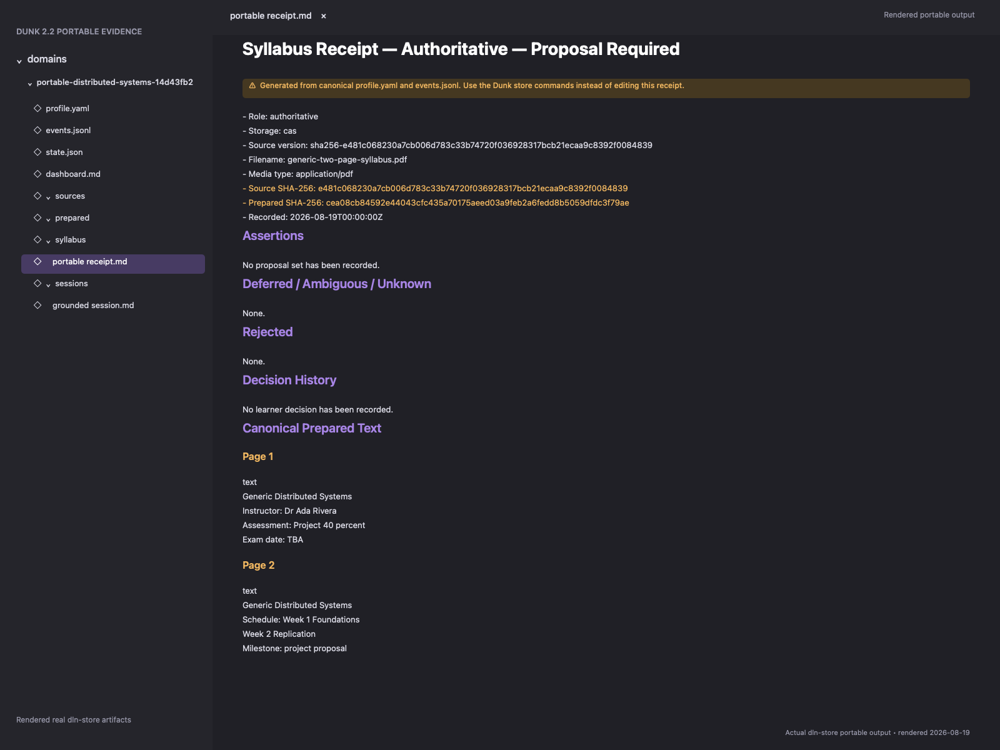
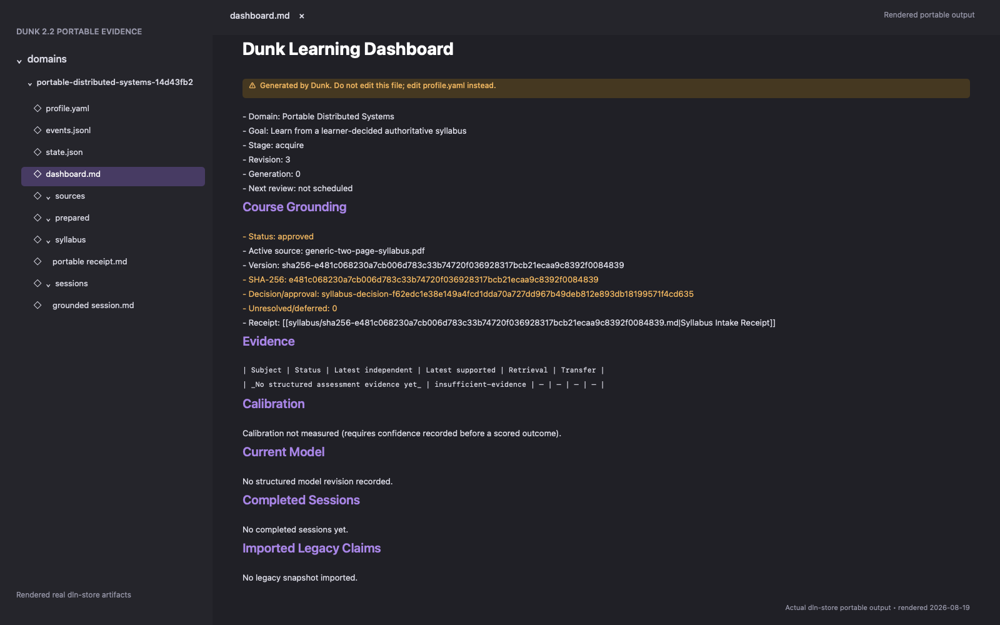
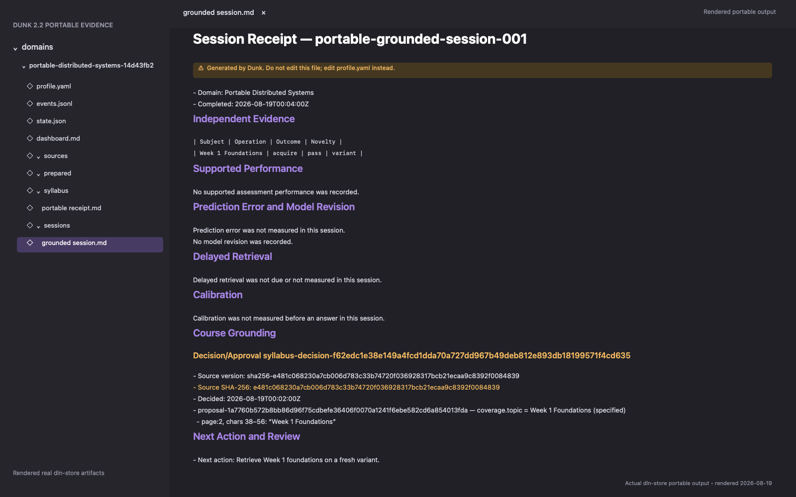
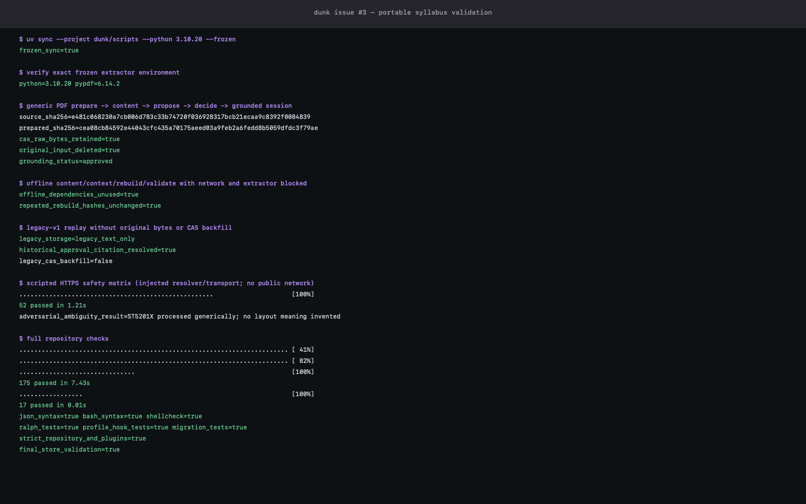

# Issue #3 — Portable Authoritative Syllabus Evidence

This package reproduces Dunk 2.2.0's generic authoritative-syllabus lifecycle with a non-ST two-page text-layer PDF. It uses a clean disposable vault and the public `prepare-syllabus` → `syllabus-content` → `propose-syllabus` → `decide-syllabus` → grounded `commit` flow. The original bytes and normalized extracted document are retained as content-addressed canonical data outside the plugin installation.

The evidence also proves deterministic offline rebuild after deleting the input PDF, legacy-v1 text-only replay, a scripted HTTPS safety matrix with no public network traffic, the exact frozen Python 3.10.20 / `pypdf==6.14.2` environment, and strict repository plus per-plugin validation. OCR is not claimed. Hashes prove internal consistency under the documented local-filesystem-owner threat model; they do not defend against an owner replacing every canonical artifact.

## Screenshots

### Prepared intake



Rendered from the real generated syllabus receipt immediately after `prepare-syllabus` and verified `syllabus-content`. The script independently checks both the raw source CAS object and prepared-document CAS object before deleting the disposable input PDF.

### Learner decision



Rendered from `dashboard.md` after the generic proposal is sealed and the learner records a complete decision. The accepted planning topic remains separate from mastery evidence.

### Grounded teaching session



Rendered from `sessions/portable-grounded-session-001.md`. Both the assessment and completion events cite the active `decision_event_id` and accepted proposal ID.

### Terminal validation



The compact transcript is generated from real final commands. Full diagnostic output stays inside the disposable evidence root and is deleted on exit.

## Reproduce

Requirements: macOS with `uv`, `jq`, ShellCheck, the `claude` CLI, and Swift/AppKit. The lifecycle and repository checks are portable; Swift/AppKit is used only to regenerate the PNGs.

```bash
bash docs/evidence/issue-3/reproduce.sh
```

The script:

1. creates a fresh disposable vault, uv cache, Python environment, hydrated requests, logs, and renderer cache;
2. performs a frozen Python 3.10.20 sync and imports exactly `pypdf==6.14.2`;
3. copies the generic PDF into disposable storage, verifies its known digest, prepares it, and reads verified canonical content;
4. verifies raw/prepared CAS filenames, hashes, byte retention, golden extraction, and the exact proposal locator;
5. saves the prepared receipt, deletes the copied input, then applies [`proposal-request.json`](proposal-request.json) and [`decision-request.json`](decision-request.json);
6. commits [`grounded-session-request.json`](grounded-session-request.json) with the returned decision/proposal IDs and verifies approved grounding;
7. deletes all derived projections, blocks network resolution and extraction subprocesses, and proves content, context, rebuild, validation, and a second rebuild use retained canonical data with unchanged hashes;
8. replays the tracked legacy-v1 ledger without its original PDF, preserves its historical `approval_event_id` citation, and proves no raw/prepared CAS backfill is invented;
9. runs the injected HTTPS acquisition/security tests, including URL, DNS, redirect, connected-peer, timeout, header, body, encoding, and media checks without contacting a public syllabus URL;
10. runs JSON and shell validation, ShellCheck, hook tests, all Dunk tests, migration tests, strict repository validation, and strict validation for every plugin;
11. rejects personal or temporary paths, authorization/cookie/API-key material, and query-bearing URLs before rendering the four PNGs.

ST5201X appears only in the acquisition suite as an additional adversarial ambiguity result processed by the same generic extractor; it is not a production adapter, evidence source, or capability claim.
